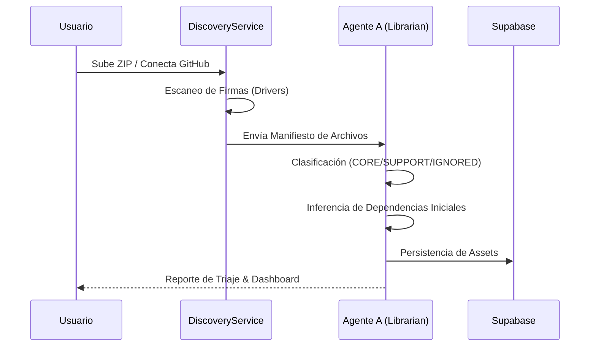

# Fase 1: Discovery & Triage (Librarian)

Esta es la etapa de ingesta donde el Agente A (**The Librarian**) actúa como el receptor inicial de la carga técnica.

## 🎯 Objetivo
Transformar archivos fuente crudos en un inventario estructurado y priorizado para la migración.

## 🤖 El Flujo del Agente A

### Acciones del Usuario
*   **Clasificar:** Validar si un archivo es Crítico (CORE) o Ignorable.
*   **Filtrar:** Utilizar el "Prompt de Refinado" para dar instrucciones masivas al Agente A.
*   **Auditar:** Revisar las "Observations" del Agente A sobre deudas técnicas detectadas.

### Resultado de la Fase
Un **Inventario de Activos** (Assets) bloqueado y categorizado en la base de datos, listo para el diseño de la malla.
