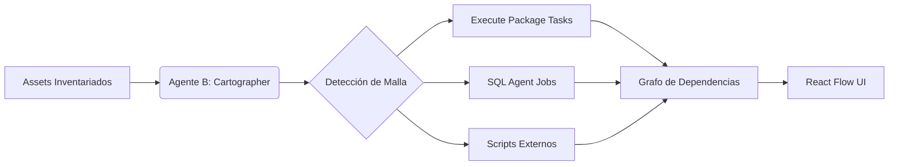

# Fase 2: Topology & Mesh (Cartographer)

Una vez que tenemos el inventario, el Agente B (**The Cartographer**) se encarga de dibujar el mapa de ejecución.

## 🎯 Objetivo
Visualizar y validar el flujo de control y las dependencias entre los componentes de la solución.

## 🤖 El Flujo del Agente B

### Funcionalidades de la Fase
*   **Graph Orchestration:** Re-ordenado automático de nodos (vía algoritmo Dagre).
*   **Drag & Drop Alignment:** El usuario puede ajustar manualmente el flujo para corregir dependencias que no estaban explícitas en el código.
*   **Parallelism Discovery:** El sistema identifica ramas del proceso que pueden ejecutarse concurrentemente en Spark, optimizando el tiempo de carga.

### Resultado de la Fase
Una **Malla de Orquestación** (Graph) aprobada por el usuario.
