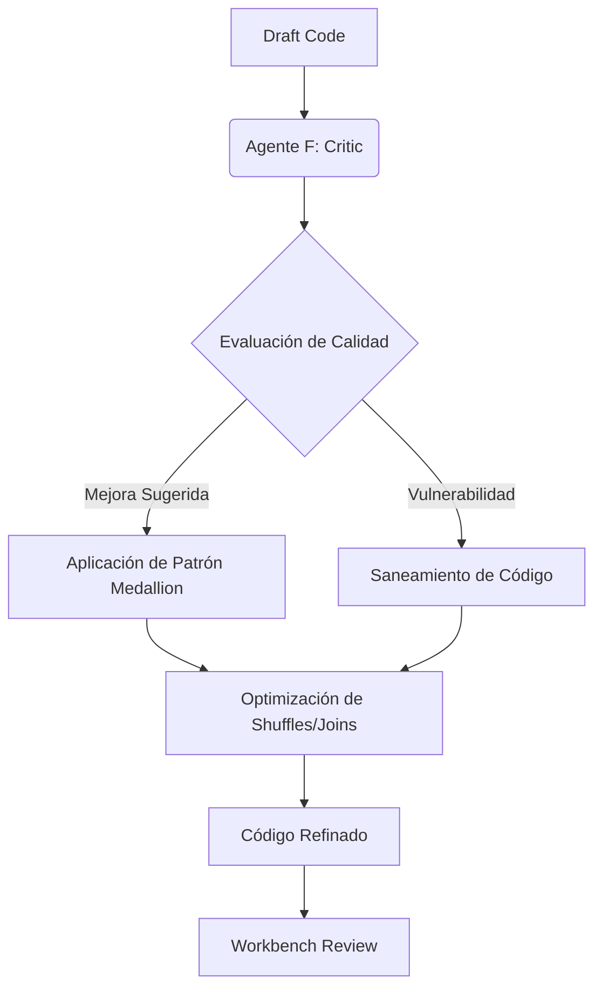

# Fase 4: Architectural Refinement (Critic)

En esta etapa, el Agente F (**The Critic**) actúa como un arquitecto senior para elevar el código del "Draft" a un nivel empresarial.

## 🎯 Objetivo
Optimizar el código para rendimiento (Spark Better Practices), seguridad y alineación con la arquitectura Medallion.

## 🤖 El Bucle de Refinamiento (Shift-T Loop)

### El Modelo Medallion
Shift-T organiza automáticamente la salida en tres capas:
1.  **Bronze:** Ingesta cruda de orígenes.
2.  **Silver:** Limpieza, filtrado y normalización.
3.  **Gold:** Agregaciones finales y lógica de negocio lista para consumo.

### Resultado de la Fase
Código **Refinado y Optimizado**, listo para ser auditado por el equipo de seguridad y cumplimiento.
