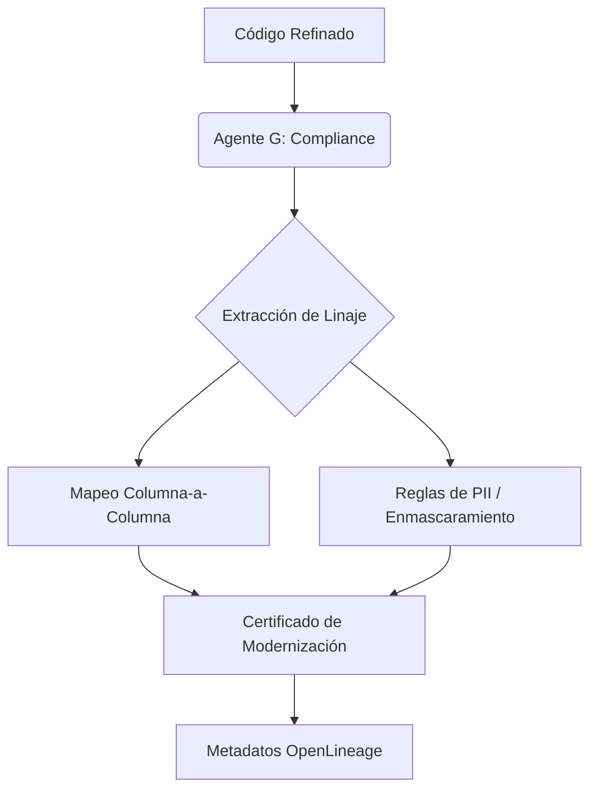

# Fase 5: Governance & Compliance (Auditor)

La modernización no es completa sin el control. El Agente G (**Compliance Auditor**) asegura que el sistema sea gobernable y transparente.

## 🎯 Objetivo
Garantizar el cumplimiento normativo, extraer metadatos de linaje y asegurar la trazabilidad del dato.

## 🤖 El Flujo de Gobernanza

### Características de Gobernanza
*   **Column-Level Lineage:** Documentación automática de la "partida de nacimiento" de cada dato.
*   **Compliance Score:** Una métrica generada por IA sobre la salud y seguridad del código migrado.
*   **Lineage Visualizer:** Integrado en la fase para ver gráficamente el flujo de transformación granular.

### Resultado de la Fase
Un conjunto de **Metadatos de Gobernanza** que acompañarán al código durante su ciclo de vida.
