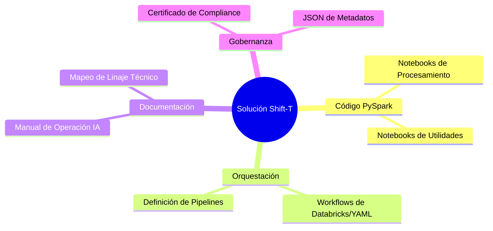

# Fase 6: Solution Export (The Bundle)

El paso final donde la modernización se materializa en activos desplegables.

## 🎯 Objetivo
Entregar un repositorio completo, documentado y listo para ser integrado en el CI/CD profesional.

## 📦 Contenido del Bundle Final

### Entrega de la Solución
*   **Manual de Operación generado por IA:** Explica los cambios estratégicos realizados (ej. qué paquete SSIS fue reemplazado por qué lógica en Spark).
*   **Exportación ZIP/Git:** Un repositorio estructurado listo para producción.

### Resultado Final
Una arquitectura de datos **Cloud-Native**, moderna y orquestada.
